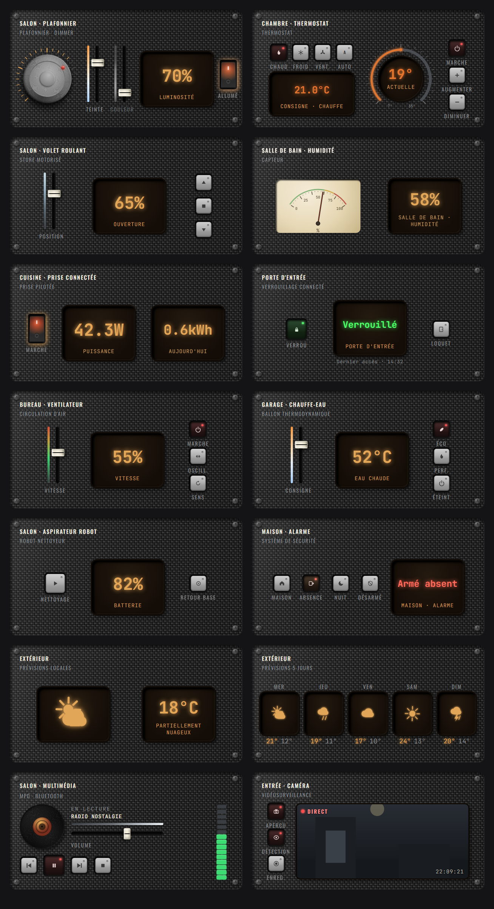
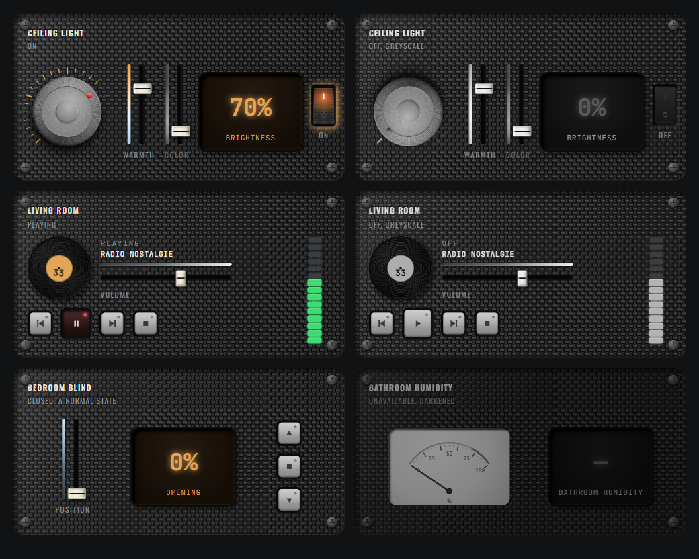

# Skeuo Cards

Pack de cartes Lovelace skeuomorphiques pour Home Assistant : façade carbone, molettes en métal usiné, faders à rail creusé, écrans LCD ambre.



Les quatorze cartes du projet, construites sur une bibliothèque de composants commune : lumière, climatisation, volet roulant, capteur, prise connectée, serrure, ventilateur, chauffe-eau, aspirateur robot, alarme, météo, prévisions, multimédia, caméra.

*[Read this in English](README.md)*

## Ce que ça fait

Chaque carte pilote une entité réelle et appelle les services Home Assistant correspondants. Les contrôles sont des vrais contrôles : la molette se prend au pointeur ou au clavier, les faders sont des `input[type=range]` pivotés qui gardent le tactile et la sémantique ARIA natifs, les boutons sont des `<button>`.

Quatre choix structurent le pack.

**Mise à l'échelle par facteur uniforme.** Le design est dessiné à une hauteur de référence fixe de 310 px, puis ramené à la taille réelle de la cellule par un `transform: scale()` calculé au `ResizeObserver`. Tout, texte compris, garde exactement les mêmes proportions à n'importe quelle taille : rien ne se tronque jamais. La largeur du plan, elle, s'étire pour remplir les sections larges au lieu de laisser deux bandes vides.

**Aucune image bitmap.** Textures, molette, vis, écrans et les seize icônes météo sont produits en CSS et en SVG, tous dessinés pour ce pack, sans jeu d'icônes extérieur. Le bundle fait 240 ko (59 ko en gzip), et le rendu reste net quelle que soit la taille d'affichage, ce qu'une photo ne permettrait pas.

**Mouvement lissé.** Aucune valeur ne saute d'un point à l'autre : position du volet, consigne du thermostat et du chauffe-eau, vitesse du ventilateur, volume du lecteur, intensité de la molette et aiguille des VU-mètres rejoignent leur cible en accélérant puis en ralentissant. La valeur elle-même est interpolée image par image, ce qui laisse les contrôles natifs en place, et absorbe au passage les paliers que remonte un appareil en cours de course. Un geste de l'utilisateur n'est jamais animé, et `prefers-reduced-motion` supprime tout.

**Filtre de rendu.** `hass` est réassigné par Home Assistant à chaque changement d'état de n'importe quelle entité du système, soit plusieurs fois par seconde. Chaque carte ne se redessine que si une de ses propres entités, le thème, la langue ou la connexion ont changé. Mesuré sur le banc d'essai : 20 changements d'entités sans rapport donnent 0 rendu, un changement suivi en donne 1.

## Installation

### HACS (dépôt personnalisé)

1. HACS → menu ⋮ → **Dépôts personnalisés**
2. URL du dépôt, catégorie **Dashboard**
3. Installer **Skeuo Cards**, puis recharger la page

HACS enregistre la ressource tout seul et gère le cache-busting.

### Manuelle

Copier `dist/skeuo-cards.js` dans `config/www/`, puis déclarer la ressource dans **Paramètres → Tableaux de bord → ⋮ → Ressources** :

```
/local/skeuo-cards.js    (type : Module JavaScript)
```

## Les cartes

Toutes se configurent à la souris depuis l'éditeur de carte. Le YAML ci-dessous est là pour référence.

### Lumière

```yaml
type: custom:skeuo-light-card
entity: light.salon
subtitle: Plafonnier · Dimmer
```

La carte s'adapte à ce que l'ampoule sait faire, lu sur `supported_color_modes` : molette de variation si elle est dimmable, fader de teinte si elle gère `color_temp`, fader de couleur si elle gère une couleur. Une ampoule en simple marche/arrêt n'affiche que l'écran et l'interrupteur.

| Option | Défaut | Rôle |
|---|---|---|
| `show_color_temp` | `true` | Masquer le fader de teinte même si l'ampoule le gère |
| `show_color` | `true` | Masquer le fader de couleur |

Le halo de l'interrupteur prend la couleur réelle de l'ampoule quand elle en expose une.

Les faders Teinte et Couleur ne gouvernent jamais la lampe en même temps : une ampoule est soit sur une température de blanc, soit sur une couleur. Celui qui n'est pas aux commandes se décolore, mais reste manipulable, et s'en servir le remet aux commandes. Le mode actif est lu sur `color_mode`, que Home Assistant bascule lui-même, donc la carte reste juste même quand la lumière est pilotée d'ailleurs : scène, automatisation, autre tablette.

La lueur et le symbole de l'interrupteur prennent la couleur réellement émise, celle du réglage aux commandes : blanc chaud ou froid en mode blanc, teinte choisie en mode couleur. Elle vient de `rgb_color` quand l'intégration le fournit, sinon elle est reconstruite depuis la température de couleur ou depuis la teinte.

La molette ne se téléporte pas à sa nouvelle valeur : le repère et l'écran la rejoignent avec la même accélération puis le même ralentissement que sur le volet et le thermostat. Le repère n'étant pas contraint par des paliers, le mouvement est aussi fluide que celui de l'aiguille du VU-mètre, à une position par image. Un geste sur la molette n'est jamais animé, sinon le repère reviendrait en arrière au relâchement.

### Climatisation

```yaml
type: custom:skeuo-climate-card
entity: climate.chambre
subtitle: Thermostat analogique
```

Les boutons de mode reprennent les `hvac_modes` déclarés par l'entité, quatre au maximum. La couleur de l'arc et des écrans suit `hvac_action` : orange en chauffe, bleu en refroidissement, ambre au repos.

La consigne ne saute pas quand on appuie sur les boutons : l'arc du cadran et l'écran la rejoignent avec la même accélération puis le même ralentissement que le volet, comme une molette qu'on tourne. La durée est réglée sur une échelle en degrés et non en pourcentage, sans quoi un pas d'un demi-degré passerait sous le seuil d'animation.

| Option | Défaut | Rôle |
|---|---|---|
| `modes` | modes de l'entité | Forcer la liste des boutons de mode |

### Volet roulant

```yaml
type: custom:skeuo-cover-card
entity: cover.salon
subtitle: Store motorisé
```

Le fader n'apparaît que si le volet sait se positionner. Chaque bouton se désactive si `supported_features` ne déclare pas l'action correspondante, donc un volet sans commande d'arrêt n'affiche pas un bouton mort.

Le curseur ne saute pas d'une position à l'autre : il rejoint la nouvelle avec une accélération puis un ralentissement, sur 300 à 820 ms selon la distance, et l'écran suit le même mouvement. La position d'un `input[type=range]` découle de sa valeur et non d'une propriété CSS, donc aucune transition ne peut l'adoucir : c'est la valeur elle-même qui est interpolée image par image, ce qui préserve l'input natif et donc le tactile, le clavier et la sémantique ARIA. Le même mécanisme absorbe les paliers d'un volet réel, qui remonte ses positions par sauts pendant sa course. Un glissement au doigt n'est jamais animé, sinon le curseur reviendrait en arrière au relâchement. Sous `prefers-reduced-motion`, le mouvement est supprimé.

### Capteur

```yaml
type: custom:skeuo-sensor-card
entity: sensor.humidite
subtitle: Capteur · VU-mètre
```

L'échelle et les seuils se déduisent de la `device_class` (humidité, température, pression, batterie, CO2, luminosité, puissance, PM2.5, COV), et restent réglables à la main.

| Option | Défaut | Rôle |
|---|---|---|
| `min` / `max` | selon `device_class` | Bornes de l'échelle |
| `warn` | `0.6` | Fin de zone verte, en fraction de l'échelle |
| `danger` | `0.85` | Fin de zone jaune |

L'unité est toujours lue sur `unit_of_measurement` de l'entité, jamais écrite en dur.

L'aiguille a l'inertie d'un galvanomètre : elle rejoint sa graduation en accélérant puis en ralentissant, jusqu'à 760 ms pour un balayage complet. L'afficheur numérique à côté change d'un coup, lui. C'est ce contraste entre le mécanique et le numérique qui rend l'instrument crédible. La durée se calcule sur la fraction d'échelle parcourue, donc un capteur de CO2 gradué de 400 à 2000 et un capteur d'humidité gradué de 0 à 100 ont la même vitesse d'aiguille.

### Prise connectée

```yaml
type: custom:skeuo-switch-card
entity: switch.prise_cuisine
subtitle: Prise pilotée
power_entity: sensor.prise_cuisine_puissance
energy_entity: sensor.prise_cuisine_energie
```

| Option | Défaut | Rôle |
|---|---|---|
| `power_entity` | vide | Capteur de puissance instantanée à afficher |
| `energy_entity` | vide | Compteur d'énergie à afficher |

Les deux capteurs sont facultatifs, et la carte s'adapte au nombre déclaré : deux écrans, un seul, ou un écran d'état quand aucun n'est relié. Leur unité est lue sur `unit_of_measurement`, donc des watts, des kilowatts ou des ampères s'affichent tels que l'entité les publie. Les capteurs comptent dans le filtre de rendu au même titre que la prise, sinon la puissance affichée resterait figée entre deux basculements.

Fonctionne aussi sur `input_boolean`, `light` et `fan` pour piloter en tout ou rien un appareil qui a par ailleurs sa propre carte.

### Serrure

```yaml
type: custom:skeuo-lock-card
entity: lock.entree
subtitle: Verrouillage connecté
```

Le gros bouton verrouille et déverrouille, l'écran donne l'état en vert, ambre ou rouge selon qu'il est fermé, ouvert ou coincé, et la ligne du dessous rappelle l'heure du dernier changement avec l'auteur quand l'intégration le remonte. Le bouton de droite actionne le pêne demi-tour, et reste inerte si `supported_features` ne déclare pas cette commande.

Une serrure qui annonce un `code_format` attend un code à chaque manœuvre : les deux boutons ouvrent alors la fiche de l'entité au lieu d'appeler un service qui échouerait.

### Ventilateur

```yaml
type: custom:skeuo-fan-card
entity: fan.bureau
subtitle: Circulation d'air
```

Le fader suit `percentage` et se cale sur `percentage_step`, donc un ventilateur à trois vitesses donne trois crans plutôt qu'un pourcentage que l'appareil arrondirait dans son coin. Il disparaît si l'entité ne sait pas régler sa vitesse, auquel cas l'écran montre l'état. Les boutons d'oscillation et de sens de rotation se désactivent selon ce que déclare `supported_features`.

À l'arrêt, le fader se décolore sans se bloquer : le manipuler rallume l'appareil.

### Chauffe-eau

```yaml
type: custom:skeuo-water-heater-card
entity: water_heater.ballon
subtitle: Ballon thermodynamique
```

| Option | Défaut | Rôle |
|---|---|---|
| `modes` | modes de l'entité | Forcer la liste des boutons de mode |

Les bornes du fader viennent de `min_temp` et `max_temp`, son pas de `target_temp_step`. L'écran montre la température réelle du ballon quand l'appareil la publie, et la consigne sinon.

La colonne de droite porte trois modes au maximum, ce que la hauteur permet : les deux premiers modes de chauffe déclarés par l'entité, et l'arrêt, qui garde sa place quelle que soit la longueur de `operation_list`. L'option `modes` permet d'en choisir d'autres.

### Aspirateur robot

```yaml
type: custom:skeuo-vacuum-card
entity: vacuum.salon
subtitle: Robot nettoyeur
```

Un seul bouton lance et suspend, comme sur l'appareil lui-même, ce qui laisse la place au retour à la base sans encombrer la carte d'un troisième poussoir. L'écran donne le niveau de batterie quand le robot le publie encore, et son état sinon : les intégrations récentes déportent la batterie sur une entité dédiée.

L'écran passe au bleu pendant le nettoyage et le retour, au rouge en cas d'erreur.

### Alarme

```yaml
type: custom:skeuo-alarm-card
entity: alarm_control_panel.maison
subtitle: Système de sécurité
```

Les quatre modes se filtrent sur `supported_features` : une centrale qui ne connaît pas l'armement de nuit n'affiche pas le bouton correspondant. Le désarmement est toujours proposé. Vert au repos, ambre pendant les temporisations d'armement et de sortie, rouge dès que le système est armé ou déclenché.

Comme pour la serrure, une centrale qui déclare un `code_format` renvoie vers la fiche de l'entité, qui présente le pavé numérique.

### Météo

```yaml
type: custom:skeuo-weather-card
entity: weather.exterieur
subtitle: Prévisions locales
```

L'icône couvre les quinze conditions du domaine `weather` et s'anime : les nuages dérivent, les gouttes tombent, le soleil tourne, l'éclair bat. Sous `prefers-reduced-motion`, tout est figé.

Une seizième icône sert la nuit. Sur les quinze conditions, une seule est nocturne, `clear-night` : les autres ne disent rien de l'heure, `rainy` est le même état à trois heures du matin qu'à midi. La seule qui contienne un soleil et qui puisse se produire après le coucher est `partlycloudy`, qui prend alors une lune derrière son nuage. Le moment se lit sur l'entité `sun.sun` et non sur la météo, comme le fait Home Assistant dans sa propre carte. Sans cette entité, l'icône de jour est conservée plutôt que devinée.

L'unité de température vient de `temperature_unit` sur l'entité et non du système d'unités : une station qui publie en Fahrenheit garde son échelle, comme le fait la carte météo native.

### Prévisions

```yaml
type: custom:skeuo-forecast-card
entity: weather.exterieur
subtitle: Prévisions 5 jours
days: 5
```

| Option | Défaut | Rôle |
|---|---|---|
| `days` | `5` | Nombre de jours affichés, de 3 à 7 |

Depuis Home Assistant 2023.9, les prévisions ne sont plus dans un attribut de l'entité : elles passent par un abonnement WebSocket. La carte s'y abonne, choisit le quotidien quand l'entité le propose et retombe sur le bi-quotidien puis l'horaire sinon. L'abonnement est coupé quand la carte quitte l'écran et rétabli quand elle revient, ce qui compte sur un tableau de bord à plusieurs vues. Les intégrations anciennes qui publient encore l'attribut `forecast` restent lues.

La largeur des colonnes se calcule sur la largeur réelle du plan, qui varie avec la cellule : une semaine entière tient dans une cellule standard en resserrant les vignettes et les températures, et s'aère dans une section large. Si la station ne renvoie que trois jours alors que sept sont demandés, la carte se répartit sur trois.

Les températures n'affichent que le degré, sans le C ni le F : deux nombres par colonne et sept colonnes ne laissent pas la place, et l'échelle complète reste lisible sur la carte météo.

La variante de nuit ne s'applique pas aux prévisions quotidiennes, qui couvrent la journée entière. Sur le découpage bi-quotidien, elle suit le champ `is_daytime` de chaque élément ; sur l'horaire, elle se déduit du prochain lever et du prochain coucher, en tenant compte des jours suivants et non du seul moment présent. L'entité `sun.sun` n'est suivie que dans ces deux cas, pour ne pas redessiner deux fois par jour une carte que l'heure ne concerne pas.

### Multimédia

```yaml
type: custom:skeuo-media-card
entity: media_player.salon
subtitle: MPD · Bluetooth
```

Le disque tourne pendant la lecture et s'arrête en pause là où il en était, sans repartir de zéro. Ses sillons sont un dégradé radial, donc nets à n'importe quelle échelle ; la pochette, elle, est l'image que publie l'entité sur `entity_picture`, et l'étiquette ambre prend sa place quand il n'y en a pas.

Le titre affiché descend `media_title`, puis `media_series_title`, `app_name` et `source` jusqu'à trouver quelque chose : les intégrations ne remplissent pas les mêmes champs, et une radio n'a souvent que le premier.

L'échelle à quinze segments suit le volume. La couleur d'un segment tient à sa position et jamais à la valeur courante, comme sur un appareil réel où la diode du haut est rouge qu'elle soit allumée ou non.

Chaque bouton de transport se désactive selon ce que déclare `supported_features`, et le fader disparaît si le lecteur ne sait pas régler son volume.

### Caméra

```yaml
type: custom:skeuo-camera-card
entity: camera.entree
subtitle: Vidéosurveillance
refresh: 10
```

| Option | Défaut | Rôle |
|---|---|---|
| `refresh` | `10` | Secondes entre deux images. `0` fige l'aperçu |
| `record_filename` | vide | Chemin passé au service `camera.record` |
| `record_duration` | `30` | Durée d'enregistrement, en secondes |

**Ce n'est pas un flux vidéo.** Le direct passe par HLS ou WebRTC, que le frontend gère avec ses propres éléments et que rien ne permet de piloter proprement depuis une carte externe. La carte affiche l'instantané que Home Assistant publie déjà sur `entity_picture`, redemandé à l'intervalle réglé, et un appui sur le moniteur ouvre la fiche de l'entité, où le vrai flux est joué. Le badge indique lequel des deux régimes est en cours, Direct ou Figé.

Rien n'est demandé à la caméra dans la vignette du sélecteur ni dans l'aperçu de l'éditeur : la carte y est instanciée plusieurs fois d'affilée, et autant de minuteries taperaient dessus pour rien. La minuterie s'arrête aussi dès que la carte quitte l'écran.

Le bouton Détection appelle `camera.enable_motion_detection` et son inverse, et reste inerte sur une caméra qui ne publie pas l'attribut `motion_detection`. Le bouton Enregistrement appelle `camera.record`, qui exige un chemin de destination : sans `record_filename`, il reste inerte lui aussi, faute de savoir où écrire.

## États



Un appareil éteint passe en niveaux de gris, façade comprise : écrans, voyants et bandes colorées se désaturent, mais rien ne devient translucide. Une carte transparente laisserait voir le fond du tableau de bord au travers de ses propres commandes, ce qui casse l'aspect de matière ; une façade grise reste une façade.

Un appareil injoignable reçoit la même désaturation plus un assombrissement, ce qui le fait reculer derrière les cartes actives et le distingue d'un simple arrêt. Là encore, c'est une baisse de luminosité, pas un voile translucide.

Les états qui ne sont pas un arrêt ne sont pas grisés : un volet fermé ou un capteur au plus bas restent des états de fonctionnement normaux.

## Options communes

| Option | Défaut | Rôle |
|---|---|---|
| `entity` | requis | Entité pilotée |
| `name` | `friendly_name` | Titre du module |
| `subtitle` | vide | Ligne sous le titre |
| `material` | `carbon` | `carbon`, `graphite` ou `brushed` |
| `accent` | `#e2a659` | Couleur des écrans et des arcs |
| `screws` | `true` | Vis d'angle |
| `texture` | `60` | Densité du grain de la matière, de 0 à 150 % |
| `tap_action` | `more-info` | Action sur le bandeau titre |
| `hold_action` | `more-info` | Appui long |
| `double_tap_action` | `more-info` | Double appui |

### Densité du grain

`texture` règle la finesse de la matière, **de 0 à 150 % par pas de 10**. Le défaut est **60 %** : une mèche de 6 px, assez pour que le croisement en damier se lise sans que le tissage prenne le pas sur les contrôles qu'il porte. À 0 le motif disparaît complètement et il ne reste que la couleur de fond, ce qui est un rendu valable en soi.

Le carbone est un tissage en armure toile : la trame traverse la carte en brins continus, les mèches de chaîne passent par-dessus, et chaque mèche porte les striations de ses filaments. Un vernis en couche séparée balaie la surface une seule fois, jamais répété avec la tuile. Le réglage redimensionne la tuile, de 2 à 30 px. À 100 % la mèche fait environ 2 mm sur une dalle de tablette, soit un tissage 3K, le plus courant en carbone réel.

| Plage | Rendu |
|---|---|
| 0 % | couleur de fond nue |
| 10 % | la tuile se moyenne, la carte s'éclaircit nettement |
| 20 à 50 % | grain fin, le croisement ne se lit plus |
| 60 à 150 % | croisement lisible, la matière se lit comme du carbone ; **60 % est le défaut** |

Sur le métal brossé, le réglage resserre ou écarte la période des rayures, de 0,3 à 4,5 px. En dessous de 50 % la période approche du pixel et produit un moiré diagonal marqué, encore perceptible jusque vers 70 %. La plage propre commence autour de 80 %.

Ces valeurs dégradées restent accessibles volontairement : c'est un choix d'affichage, pas une erreur à empêcher.

Le graphite n'a pas de grain, c'est un dégradé unique étalé sur la carte : le réglage n'a aucun effet dessus.

Pour appliquer la même densité à toutes les cartes d'un coup plutôt que carte par carte, la variable CSS suffit :

```yaml
card_mod:
  style: |
    :host { --skeuo-texture: 1.5; }
```

## Actions

Les actions acceptent le vocabulaire habituel de Home Assistant : `more-info`, `toggle`, `navigate`, `url`, `perform-action`, `assist`, `fire-dom-event`, `none`, avec `confirmation`.

## Personnalisation

Le pack expose des variables CSS, redéfinissables par thème ou par `card-mod` :

```yaml
card_mod:
  style: |
    :host {
      --skeuo-accent: #6bdcff;
      --skeuo-font-display: "Oswald", sans-serif;
      --skeuo-font-lcd: "JetBrains Mono", monospace;
    }
```

Aucune police n'est embarquée dans le bundle : ce serait une trentaine de ko de WOFF2, ou une requête réseau vers Google Fonts. Le pack s'appuie sur une pile condensée disponible partout. Le rendu d'origine utilise Oswald et JetBrains Mono ; pour le retrouver exactement, installer ces polices et pointer les deux variables ci-dessus dessus.

## Placement dans la grille

Chaque carte annonce `getGridOptions()` avec 12 colonnes et un nombre de lignes calculé sur son ratio, ce qui la fait tomber juste dans une section de largeur standard. Le nombre de lignes reste modifiable à la poignée de redimensionnement, ou en YAML :

```yaml
grid_options:
  columns: 6
  rows: 3
```

Dans une cellule trop étroite pour la largeur nominale, le facteur d'échelle bascule sur la largeur : il reste une bande vide en haut et en bas, mais rien n'est rogné.

## Limites connues

- La carte caméra montre un instantané rafraîchi, pas un flux continu. Voir la section qui lui est consacrée.
- Les serrures et les centrales d'alarme qui exigent un code ne se pilotent pas depuis la carte : le bouton ouvre la fiche de l'entité, qui sait présenter le pavé de saisie. Mettre le code dans la configuration du tableau de bord reviendrait à l'écrire en clair dans un fichier YAML sauvegardé et synchronisé.
- Le pack impose son propre habillage et ne suit pas les couleurs du thème actif, par construction. Il respecte en revanche `--ha-card-border-radius` et `prefers-reduced-motion`.
- Le design est pensé pour une tablette murale et un dashboard de bureau. En dessous d'environ 300 px de large, le contenu reste lisible mais devient petit.

## Développement

```bash
npm install
npm run build
```

```bash
npm run watch
```

`npm run serve` sert le bundle sur le port 4000 avec CORS ouvert : déclarer `http://<ip>:4000/skeuo-cards.js` en ressource sur une instance Home Assistant de test.

`dev/index.html` est un banc d'essai autonome, avec un `hass` simulé, les deux largeurs de section, et des entités volontairement cassées (indisponible, introuvable, sans variateur) pour vérifier les rendus dégradés. Il sert le bundle depuis `dist/`, donc lancer `npm run build` avant.

## Avertissement

Ce projet est partagé librement, monté sur mon temps libre. Je ne suis pas responsable des problèmes que son utilisation pourrait causer, matériels, logiciels ou autres. Vous l'utilisez, l'installez et l'adaptez entièrement à vos risques. Les fichiers sont libres d'usage, de partage et de modification. Si vous réutilisez ce travail ou construisez dessus, un crédit est apprécié, mais rien n'est fourni avec la moindre garantie.

## Soutenir le projet

Si ce pack vous a été utile, vous pouvez soutenir son développement :

- [GitHub Sponsors](https://github.com/sponsors/dcybeldesign)
- [Buy Me a Coffee](https://buymeacoffee.com/dcybeldesign)

## Auteur

[dcybeldesign](https://github.com/dcybeldesign)

## Licence

[MIT](LICENSE)

Le code est sous licence MIT. Le nom **Skeuo Cards** ne fait pas partie de cette concession : forkez, reconstruisez, publiez, mais sous votre propre nom.
